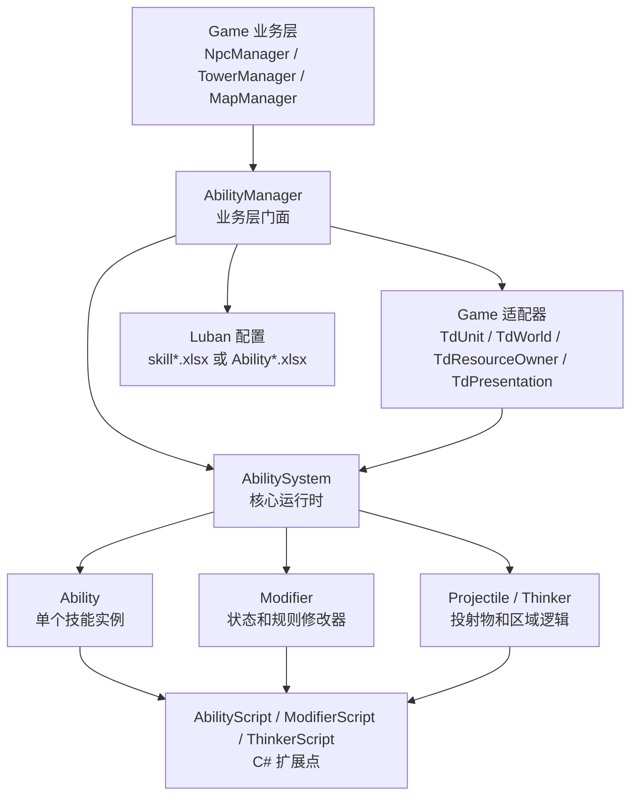
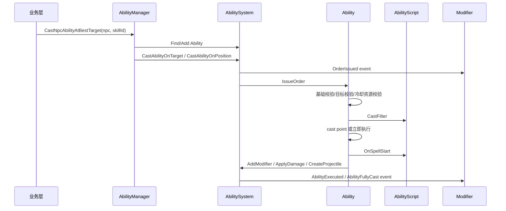

# Ability 技能系统文档

更新时间：2026-05-25  
命名空间：`Game.Ability`  
业务入口：`Game.AbilityManager`

## 目录

1. [系统定位](#系统定位)
2. [整体架构](#整体架构)
3. [代码目录](#代码目录)
4. [核心概念](#核心概念)
5. [运行流程](#运行流程)
6. [业务层用法](#业务层用法)
7. [配置数据组织](#配置数据组织)
8. [技能组合方式](#技能组合方式)
9. [C# 自定义技能](#c-自定义技能)
10. [Modifier 状态系统](#modifier-状态系统)
11. [投射物和 Thinker](#投射物和-thinker)
12. [扩展与维护建议](#扩展与维护建议)
13. [当前状态和限制](#当前状态和限制)

## 系统定位

当前 Ability 系统是一套偏 Dota2 风格的运行时技能系统，但不提供 Lua 接口。  
它使用 C# 脚本扩展点替代 Lua，并通过数据表组织常见技能效果。

核心目标：

- `Game.Ability` 不依赖业务层 `Game`。
- 业务层只通过 `AbilityManager` 使用技能系统。
- 技能可以由数据配置组合，也可以由 C# 自定义脚本实现复杂逻辑。
- `Ability` 表示技能入口和运行时实例。
- `Modifier` 表示持续状态、属性修改、被动规则、光环和事件响应。
- `AbilitySystem` 统一管理技能、状态、投射物、Thinker、伤害、治疗和事件。

## 整体架构



推荐依赖方向：

```text
Game 业务层
  -> AbilityManager
      -> AbilitySystem
          -> Ability / Modifier / Projectile / Thinker
```

不要让普通业务代码直接拼装 `AbilitySystem`、`AbilityDefinition` 或 `ModifierDefinition`。  
这些工作应该放在 `AbilityManager` 和配置转换层里。

## 代码目录

### 核心模块

路径：`Assets/Scripts/Ability`

```text
Ability/
  Core/
    AbilitySystem.cs       核心运行时和对象容器
    Ability.cs             单个技能实例
    Modifier.cs            单个状态/规则修改器实例
    Projectile.cs          投射物运行时
    Thinker.cs             区域逻辑运行时
    Targeting.cs           目标规则和 CastContext 构建
    ActionRunner.cs        数据驱动 action 执行器
    Definitions.cs         Ability/Modifier/Projectile 数据定义
    Runtime.cs             CastOrder/CastResult/DamageInfo 等运行时数据
    Enums.cs               行为、目标、状态、伤害、事件等枚举
  Interfaces/
    Interfaces.cs          IUnit/IWorld/IResourceOwner/IPresentation
  Scripting/
    AbilityScript.cs       技能 C# 扩展基类
    ModifierScript.cs      Modifier C# 扩展基类
    ThinkerScript.cs       Thinker C# 扩展基类
    Configured*.cs         数据驱动默认脚本
```

### 业务适配层

路径：`Assets/Scripts/Game/AbilityAdapters`

```text
AbilityManager.cs          业务层唯一推荐入口
AbilityConfigConverter.cs  当前旧 skill 表到 Ability 定义的转换器
TdUnit.cs                  Npc/Tower/Base -> IUnit
TdWorld.cs                 业务世界查询 -> IWorld
TdResourceOwner.cs         道具/资源 -> IResourceOwner
TdPresentation.cs          特效/声音 -> IPresentation
```

### 配置模板

路径：`Data/Excel`

```text
AbilityConfig.xlsx
AbilityAction.xlsx
AbilityModifier.xlsx
AbilityModifierProperty.xlsx
AbilityProjectile.xlsx
AbilitySpecialValue.xlsx
AbilitySystemEnum.xlsx
```

路径：`Data/Defines`

```text
ability_config.xml
ability_action.xml
ability_modifier.xml
ability_modifier_property.xml
ability_projectile.xml
ability_special_value.xml
ability_system_enum.xml
```

## 核心概念

### AbilitySystem

`AbilitySystem` 是核心运行时。

负责：

- 注册 `AbilityDefinition`、`ModifierDefinition`。
- 创建和移除 `Ability`。
- 每帧更新 `Ability`、`Modifier`、`Projectile`、`Thinker`。
- 处理施法入口、目标搜索、冷却、伤害、治疗、事件派发。
- 管理 Modifier 的增删、刷新、驱散、属性查询和状态查询。

它偏底层，不是业务友好 API。  
业务层应该通过 `AbilityManager` 调用。

### Ability

`Ability` 是某个单位身上的一个技能实例。

保存：

- 所属单位 `Owner`
- 技能定义 `Definition`
- 当前等级 `Level`
- 冷却 `CooldownRemaining`
- 充能 `Charges`
- 当前阶段 `Idle / Casting / Channeling`
- C# 技能脚本 `AbilityScript`
- 内建被动 modifier

它不是业务入口。业务层可以拿到它作为运行时句柄查看状态，但不要直接创建它。

### Modifier

`Modifier` 是持续状态和规则修改器。

它可以表示：

- buff
- debuff
- stun/root/silence 等状态
- 移速、攻速、伤害加成等属性修改
- 被动效果
- 光环源和光环效果
- 周期性逻辑
- 对伤害、治疗、施法等事件的响应

Modifier 被移除后，它贡献的状态和属性会自动消失。

### AbilityScript

`AbilityScript` 是技能的 C# 自定义接口。

常用重写点：

```csharp
public override CastResult CastFilter(CastContext context)
public override void OnSpellStart(CastContext context)
public override void OnChannelThink(float deltaTime)
public override void OnChannelFinish(bool interrupted)
public override void OnToggle(bool enabled)
public override bool OnProjectileHit(Projectile projectile, IUnit target, Vector3 position)
```

### ModifierScript

`ModifierScript` 是状态的 C# 自定义接口。

常用重写点：

```csharp
public override void OnCreated(ModifierApplyOptions options)
public override void OnRefresh(ModifierApplyOptions options)
public override void OnDestroy()
public override void OnIntervalThink()
public override void OnEvent(ModifierEvent modifierEvent)
public override float GetProperty(ModifierProperty property, ModifierPropertyContext context)
public override bool CheckState(UnitState state)
```

## 运行流程

### 初始化

```text
GameEntry.Initialize
  -> AbilityManager.Initialize
      -> AbilitySystem.Initialize(TdWorld, TdPresentation)
      -> RegisterDefinitions
          -> 读取配置
          -> 转成 AbilityDefinition / ModifierDefinition
          -> 注册到 AbilitySystem
```

当前代码中，`AbilityManager.RegisterDefinitions()` 仍然读取旧表：

- `skill.xlsx`
- `skill_action.xlsx`
- `skill_modifier.xlsx`

这些表通过 `AbilityConfigConverter` 转换成 Ability 系统定义。

### 施法



### 每帧更新

```text
GameEntry.Update
  -> AbilityManager.Update(deltaTime)
      -> AbilitySystem.Update(deltaTime)
          -> Ability.Tick
              -> 冷却、充能、施法前摇、引导
          -> Modifier.Tick
              -> 持续时间、周期逻辑、光环刷新
          -> Thinker.Tick
          -> Projectile.Tick
```

## 业务层用法

业务层推荐只使用：

```csharp
AbilityManager.Instance
```

### 生命周期

```csharp
AbilityManager.Instance.Initialize();
AbilityManager.Instance.Update(Time.deltaTime);
AbilityManager.Instance.Release();
```

当前调用位置：

- `GameEntry.Initialize`
- `GameEntry.Update`
- `GameEntry.Release`

### 给单位添加技能

```csharp
AbilityManager.Instance.AddAbilityToNpc(npc, skillId, level);
AbilityManager.Instance.AddAbilityToTower(tower, skillId, level);
AbilityManager.Instance.AddAbilityToBase(skillId, level);
```

也可以对已经适配好的 `IUnit` 调用：

```csharp
AbilityManager.Instance.AddAbility(owner, skillId, level);
```

### 施放技能

无目标：

```csharp
AbilityManager.Instance.CastAbility(caster, skillId);
```

单位目标：

```csharp
AbilityManager.Instance.CastAbilityOnTarget(caster, skillId, target);
```

点目标：

```csharp
AbilityManager.Instance.CastAbilityOnPosition(caster, skillId, position);
```

让系统自动找最近目标：

```csharp
AbilityManager.Instance.CastNpcAbilityAtBestTarget(npc, skillId);
AbilityManager.Instance.CastTowerAbilityAtBestTarget(tower, skillId);
AbilityManager.Instance.CastBaseAbilityAtBestTarget(skillId);
```

### 状态查询

```csharp
AbilityManager.Instance.HasState(npc, UnitState.Stunned);
AbilityManager.Instance.IsStunned(npc);
AbilityManager.Instance.IsRooted(npc);
AbilityManager.Instance.IsCommandRestricted(npc);
AbilityManager.Instance.IsActionRestricted(tower);
AbilityManager.Instance.IsMovementRestricted(npc);
```

### 攻击和属性接入

普通攻击也可以走 Ability 系统的伤害管线，从而吃到 Modifier 加成和减伤：

```csharp
AbilityManager.Instance.ApplyTowerAttackDamage(tower, target, damage);
AbilityManager.Instance.ApplyNpcAttackDamageToBase(npc, damage);
```

业务层可查询属性修正：

```csharp
float moveSpeedMultiplier = AbilityManager.Instance.GetMoveSpeedMultiplier(npc);
float attackIntervalMultiplier = AbilityManager.Instance.GetAttackIntervalMultiplier(tower);
```

### 手动添加 Modifier

```csharp
AbilityManager.Instance.AddModifierToNpc(npc, modifierId, duration);
AbilityManager.Instance.AddModifierToTower(tower, modifierId, duration);
AbilityManager.Instance.AddModifierToBase(modifierId, duration);
```

## 配置数据组织

### 原则

`Game.Ability` 核心不应该亲自查表，也不应该依赖 `DataManager`。

推荐方式：

```text
Luban Excel
  -> DataManager 读取生成数据
      -> AbilityManager / Converter 转换
          -> AbilityDefinition / ModifierDefinition / ProjectileDefinition
              -> AbilitySystem.Register*
```

也就是说：

- 核心系统吃 `Definition` 对象。
- 业务层或配置层负责读表。
- 转换器负责把表字段映射到核心枚举和定义。

### 当前兼容表

当前实际接入的是旧技能表：

```text
skill.xlsx
skill_action.xlsx
skill_modifier.xlsx
skill_system_enum.xlsx
```

这些表能覆盖基础能力：

- 无目标、单位目标、点目标
- 基础冷却、范围、蓝耗
- 伤害
- 治疗
- 添加 Modifier
- 基础属性和状态
- 周期性 action

但它们不完整，缺少或弱化了：

- special values
- charges
- target flags
- projectile
- aura
- modifier attributes
- 多属性 modifier
- 更完整的事件触发配置
- C# script key

### 新 Ability 表模板

已经创建的新表是更适合当前 Ability 系统的正式结构。

#### AbilityConfig.xlsx

主技能表。每行是一种技能定义。

关键字段：

```text
id
name
displayName
description
icon
maxLevel
behavior
targetTeam
targetType
targetFlags
castRange
aoeRadius
castPoint
castBackswing
channelTime
cooldown
manaCost
maxCharges
chargeRestoreTime
startFullCharges
chargeUsesCooldown
actionGroupId
intrinsicModifierId
scriptName
enable
```

`castRange`、`cooldown`、`manaCost` 等字段设计为字符串，建议用 `|` 表示等级值：

```text
600|700|800
```

转换器可以解析成 `LevelValue`。

#### AbilityAction.xlsx

技能和 Modifier 的数据驱动动作表。  
通过 `groupId` 被 `AbilityConfig` 或 `AbilityModifier` 引用。

常见 action：

```text
Damage
Heal
AddModifier
Purge
CreateTrackingProjectile
CreateLinearProjectile
PlayEffect
PlaySound
```

关键字段：

```text
groupId
order
actionType
target
value
valueSpecialName
duration
durationSpecialName
damageType
damageFlags
modifierId
projectileId
effectName
soundName
```

#### AbilityModifier.xlsx

Modifier 主表。每行是一种 buff/debuff/被动/光环。

关键字段：

```text
id
name
displayName
isHidden
isDebuff
isPurgable
removeOnDeath
duration
interval
maxStack
attributes
states
propertyGroupId
onCreatedActionGroupId
onRefreshActionGroupId
onDestroyActionGroupId
intervalActionGroupId
triggerEventType
triggerActionGroupId
auraModifierId
auraRadius
auraDuration
auraThinkInterval
auraTargetTeam
auraTargetType
auraTargetFlags
scriptName
```

#### AbilityModifierProperty.xlsx

Modifier 属性组表。  
用于一个 Modifier 同时提供多个属性。

```text
groupId
property
value
```

例如一个光环同时增加攻速和移速。

#### AbilityProjectile.xlsx

投射物定义表。

```text
speed
radius
distance
deleteOnHit
providesVision
visionRadius
targetTeam
targetType
targetFlags
effectName
soundName
```

#### AbilitySpecialValue.xlsx

特殊数值表。  
用于 C# 脚本或 action 引用。

```text
abilityId
name
values
```

示例：

```text
abilityId = 1001
name = damage
values = 100|150|200|250
```

C# 中读取：

```csharp
float damage = GetSpecialValue("damage");
```

#### AbilitySystemEnum.xlsx

给策划查值用的枚举说明表。  
它不是运行时必需表，但对维护 Excel 很重要。

### 关键枚举值

`AbilityBehavior` 是位标记：

```text
Hidden = 1
Passive = 2
NoTarget = 4
UnitTarget = 8
PointTarget = 16
Aoe = 32
Channelled = 64
Toggle = 128
Immediate = 256
RootDisables = 512
AutoCast = 1024
OptionalUnitTarget = 2048
Directional = 4096
```

示例：

```text
单位目标 + AOE = 8 + 32 = 40
点目标 + AOE = 16 + 32 = 48
```

`TargetTeam`：

```text
Friendly = 1
Enemy = 2
Both = 3
```

`DamageType`：

```text
Physical = 1
Magical = 2
Pure = 3
```

`ActionTarget`：

```text
Caster = 1
PrimaryTarget = 2
ContextTargets = 3
Point = 4
```

## 技能组合方式

### 纯配置技能

适合：

- 造成伤害
- 治疗
- 加 buff/debuff
- 播放特效和声音
- 简单周期伤害
- 简单光环

组合方式：

```text
AbilityConfig
  -> actionGroupId
      -> AbilityAction: Damage
      -> AbilityAction: AddModifier

AbilityModifier
  -> intervalActionGroupId
      -> AbilityAction: Damage
```

例子：火球术

```text
AbilityConfig
  id = 1001
  behavior = UnitTarget
  targetTeam = Enemy
  cooldown = 3
  manaCost = 10
  actionGroupId = 10010

AbilityAction
  groupId = 10010
  order = 1
  actionType = Damage
  target = PrimaryTarget
  value = 100|150|200
  damageType = Magical

AbilityAction
  groupId = 10010
  order = 2
  actionType = AddModifier
  target = PrimaryTarget
  modifierId = 2001
  duration = 3
```

### 配置 + C# 技能

适合：

- 分裂弹
- 多段技能
- 复杂寻路/目标选择
- 根据战场状态动态改变效果
- 复杂投射物命中逻辑
- 特殊状态交互

方式：

1. 表里配置基础信息、冷却、蓝耗、目标类型。
2. `scriptName` 或代码注册指定 C# 脚本。
3. C# 脚本在 `OnSpellStart` 中实现复杂逻辑。

## C# 自定义技能

### 注册脚本

在技能被添加到单位之前注册：

```csharp
AbilityManager.Instance.RegisterAbilityScript(1001, () => new FireballAbilityScript());
AbilityManager.Instance.RegisterModifierScript(2001, () => new BurnModifierScript());
```

当前注册 API 使用 `skillId/modifierId`。  
如果后续切到 `Ability*.xlsx`，建议继续使用 `abilityId/modifierId`。

### 自定义 AbilityScript

```csharp
using Game.Ability;
using UnityEngine;

public sealed class FireballAbilityScript : AbilityScript
{
    public override void OnSpellStart(CastContext context)
    {
        if (context.Target == null)
        {
            return;
        }

        float damage = GetSpecialValue("damage");
        Engine.ApplyDamage(new DamageInfo
        {
            Engine = Engine,
            Attacker = Caster,
            Victim = context.Target,
            Ability = Ability,
            Amount = damage,
            DamageType = DamageType.Magical
        });
    }
}
```

### 自定义 ModifierScript

```csharp
using Game.Ability;

public sealed class BurnModifierScript : ModifierScript
{
    public override void OnIntervalThink()
    {
        Engine.ApplyDamage(new DamageInfo
        {
            Engine = Engine,
            Attacker = Caster,
            Victim = Parent,
            Ability = Ability,
            Amount = 20f,
            DamageType = DamageType.Magical
        });
    }
}
```

## Modifier 状态系统

### 状态

`UnitState` 可以表示：

```text
Stunned
Silenced
Muted
Rooted
Disarmed
Hexed
Invulnerable
MagicImmune
OutOfGame
CommandRestricted
NoUnitCollision
Untargetable
```

业务层目前使用：

- `Stunned`
- `Rooted`
- `CommandRestricted`

`NpcManager` 用它们限制移动和行为。  
`TowerManager` 用它们限制攻击行为。

### 属性

`ModifierProperty` 当前支持：

```text
MoveSpeedBonusPercent
AttackSpeedBonus
DamageOutgoingPercent
DamageIncomingPercent
SpellAmplifyPercent
ArmorBonus
HealthRegen
CooldownReductionPercent
CastRangeBonus
```

属性默认按加法累计。

### 驱散

`AbilitySystem.Purge` 支持：

```csharp
Purge(unit, removePositiveBuffs, removeDebuffs, onlyPurgable);
```

数据 action 里也支持 `Purge`。

## 投射物和 Thinker

### Projectile

投射物分两类：

- Tracking projectile：跟踪目标。
- Linear projectile：沿方向飞行，按半径检测命中。

创建入口：

```csharp
Engine.CreateTrackingProjectile(...)
Engine.CreateLinearProjectile(...)
```

命中时会回调：

```csharp
AbilityScript.OnProjectileHit(...)
```

### Thinker

Thinker 表示一个持续存在的区域逻辑对象。  
适合：

- 地面持续伤害
- 区域减速
- 延迟爆炸
- 周期搜索目标

创建入口：

```csharp
Engine.CreateThinker(new ThinkerRequest { ... });
```

扩展脚本：

```csharp
ThinkerScript.OnThink(deltaTime)
ThinkerScript.OnIntervalThink()
ThinkerScript.OnDestroy()
```

## 扩展与维护建议

### 新增一个纯配置技能

1. 在 `AbilityConfig.xlsx` 添加主技能。
2. 在 `AbilityAction.xlsx` 添加 action group。
3. 如果需要状态，在 `AbilityModifier.xlsx` 添加 modifier。
4. 如果 modifier 有属性，在 `AbilityModifierProperty.xlsx` 添加 property group。
5. 如果需要投射物，在 `AbilityProjectile.xlsx` 添加 projectile。
6. 跑 Luban 生成。
7. 在转换器中把新表转成核心 `Definition`。

### 新增一个 C# 技能

1. 新建 `AbilityScript` 子类。
2. 如有持续状态，新建 `ModifierScript` 子类。
3. 在初始化阶段注册脚本 factory。
4. 表里仍配置冷却、目标、范围、蓝耗和 special values。
5. 业务层通过 `AbilityManager` 添加或施放技能。

### 切换到 Ability 新表

当前新表只创建了模板和 Luban define，还没有接入运行时代码。  
完整切换步骤：

1. 运行 Luban 生成 `AbilityConfig`、`AbilityActionConfig` 等 C# 和 bytes。
2. 在 `DataManager` 增加对应 `ConfigTableReader`。
3. 新建或扩展 converter，从 `Ability*.xlsx` 转成：
   - `AbilityDefinition`
   - `ModifierDefinition`
   - `ProjectileDefinition`
4. 修改 `AbilityManager.RegisterDefinitions()`，优先读取新 Ability 表。
5. 保留旧 `skill*.xlsx` 转换器一段时间作为兼容层。

## 当前状态和限制

已完成：

- `Game.Ability` 核心模块。
- `AbilityManager` 业务门面。
- Npc/Tower/Base 适配。
- 旧 `skill*.xlsx` 到 Ability 定义的兼容转换。
- `Ability*.xlsx` 新表模板和 Luban define。
- 数据驱动 action。
- C# 自定义 Ability/Modifier/Thinker 接口。
- Modifier 状态和属性系统。
- 投射物和 Thinker 基础运行时。

仍需完善：

- 新 `Ability*.xlsx` 尚未跑 Luban 生成。
- `DataManager` 尚未暴露新 Ability 表。
- `AbilityManager.RegisterDefinitions()` 尚未切到新 Ability 表。
- `AbilityManager.Engine` 当前仍是 public，高级调试可用，但普通业务代码不建议直接使用。
- 尚未实现完整 Dota2 级别的优先级、状态抗性、复杂驱散分类、幻象、法球、天赋、物品技能等。

## 快速判断

业务层需要技能时：

```text
用 AbilityManager
```

需要新增配置技能时：

```text
填 Ability*.xlsx -> Luban -> Converter -> AbilityDefinition
```

需要复杂技能时：

```text
配置基础信息 + 写 AbilityScript / ModifierScript
```

核心系统应该保持：

```text
不读表
不依赖 Game
只处理已注册的 Definition 和运行时对象
```
